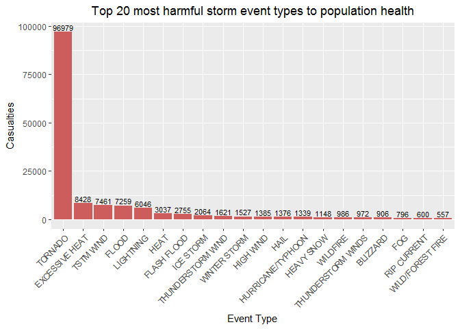
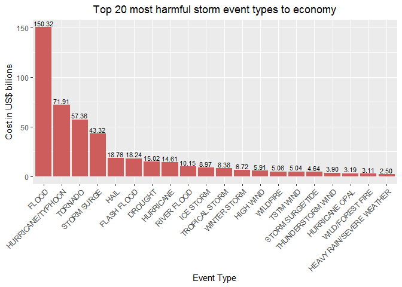

Synopsis
--------

The goal of the assignment is to explore the [NOAA Storm Database](https://d396qusza40orc.cloudfront.net/repdata%2Fdata%2FStormData.csv.bz2) and investigate which types of severe weather events are most harmful on:

1.  Population health (injuries and fatalities)
2.  Economy (property and crop damages)

The events in the database start in the year 1950 and end in November 2011.

Data Processing
---------------

Load libraries.

``` r
library(dplyr)
```

    ## Warning: package 'dplyr' was built under R version 3.2.5

    ## 
    ## Attaching package: 'dplyr'

    ## The following objects are masked from 'package:stats':
    ## 
    ##     filter, lag

    ## The following objects are masked from 'package:base':
    ## 
    ##     intersect, setdiff, setequal, union

``` r
library(ggplot2)
```

    ## Warning: package 'ggplot2' was built under R version 3.2.5

Download and unzip the storm data file.

``` r
dataFile = "repdata%2Fdata%2FStormData.csv.bz2"
if (!file.exists(dataFile)){
        fileURL <- "https://d396qusza40orc.cloudfront.net/repdata%2Fdata%2FStormData.csv.bz2"
        download.file(fileURL, zipFile, method="curl")
}  
```

Load storm data (only relevant columns for the analysis).

``` r
storm <- read.csv(dataFile)[,c("EVTYPE", "FATALITIES", "INJURIES", "PROPDMG", "PROPDMGEXP", "CROPDMG", "CROPDMGEXP")]
head(storm, 10)
```

    ##     EVTYPE FATALITIES INJURIES PROPDMG PROPDMGEXP CROPDMG CROPDMGEXP
    ## 1  TORNADO          0       15    25.0          K       0           
    ## 2  TORNADO          0        0     2.5          K       0           
    ## 3  TORNADO          0        2    25.0          K       0           
    ## 4  TORNADO          0        2     2.5          K       0           
    ## 5  TORNADO          0        2     2.5          K       0           
    ## 6  TORNADO          0        6     2.5          K       0           
    ## 7  TORNADO          0        1     2.5          K       0           
    ## 8  TORNADO          0        0     2.5          K       0           
    ## 9  TORNADO          1       14    25.0          K       0           
    ## 10 TORNADO          0        0    25.0          K       0

Discard events with non casualties or property / cost damages:

``` r
storm <- storm %>% filter(INJURIES > 0 | FATALITIES > 0 | PROPDMG > 0 | CROPDMG > 0)
```

Add casualties column (sum of fatalities and injuries).

``` r
storm$casualties <- storm$FATALITIES + storm$INJURIES
```

Define function to convert property / crop damage exponents to numeric values for cost calculations.

``` r
exponentMap <- function(exponent) {
        if (exponent == "")
                return (10^0)
        map <- c("0" = 10^0, "1" = 10^1, "2" = 10^2, "3" = 10^3,
          "4" = 10^4, "5" = 10^5, "6" = 10^6, "7" = 10^7,
          "8" = 10^8, "9" = 10^9, "h" = 10^2, "k" = 10^3,
          "m" = 10^6, "b" = 10^9, "-" = 10^0, "?" = 10^0,
          "+" = 10^0)
        return (map[tolower(exponent)])
} 
```

Add economic cost column (sum of property and crop costs).

``` r
storm$economicCost <- storm$PROPDMG * unlist(lapply(storm$PROPDMGEXP, exponentMap)) + storm$CROPDMG * unlist(lapply(storm$CROPDMGEXP, exponentMap))
```

Group casualties by event type.

``` r
casualtiesByEvtype <- storm %>%
        group_by(EVTYPE) %>%
        summarise(casualties = sum(casualties))
head(casualtiesByEvtype, 10)
```

    ## # A tibble: 10 × 2
    ##                    EVTYPE casualties
    ##                    <fctr>      <dbl>
    ## 1      HIGH SURF ADVISORY          0
    ## 2             FLASH FLOOD          0
    ## 3               TSTM WIND          0
    ## 4         TSTM WIND (G45)          0
    ## 5                       ?          0
    ## 6     AGRICULTURAL FREEZE          0
    ## 7           APACHE COUNTY          0
    ## 8  ASTRONOMICAL HIGH TIDE          0
    ## 9   ASTRONOMICAL LOW TIDE          0
    ## 10               AVALANCE          1

Group economic cost by event type.

``` r
economicCostByEvtype <- storm %>%
        group_by(EVTYPE) %>%
        summarise(economicCost = sum(economicCost))
head(economicCostByEvtype, 10)
```

    ## # A tibble: 10 × 2
    ##                    EVTYPE economicCost
    ##                    <fctr>        <dbl>
    ## 1      HIGH SURF ADVISORY       200000
    ## 2             FLASH FLOOD        50000
    ## 3               TSTM WIND      8100000
    ## 4         TSTM WIND (G45)         8000
    ## 5                       ?         5000
    ## 6     AGRICULTURAL FREEZE     28820000
    ## 7           APACHE COUNTY         5000
    ## 8  ASTRONOMICAL HIGH TIDE      9425000
    ## 9   ASTRONOMICAL LOW TIDE       320000
    ## 10               AVALANCE            0

Results
-------

Top 20 types of storm events which are most harmful to population health.

``` r
n <- 20
topCasualtiesByEvtype <- slice(casualtiesByEvtype, order(-casualtiesByEvtype$casualties)[1:n])

ggplot(topCasualtiesByEvtype, aes(x=reorder(EVTYPE, -casualties), y = casualties)) +
        geom_bar(stat="identity", fill = "indianred") +
        geom_text(aes(label=paste(sprintf("%d", casualties))), position=position_dodge(width=0.9), vjust=-0.25, size=3) +
        labs(title = "Top 20 most harmful storm event types to population health", x = "Event Type", y = "Casualties") +
        theme(axis.text.x = element_text(angle = 45, hjust = 1)) +
        theme(plot.title = element_text(hjust = 0.5))
```



Top 20 types of storm events with greatest economic impact.

``` r
n <- 20
topEconomicCostByEvtype <- slice(economicCostByEvtype, order(-economicCostByEvtype$economicCost)[1:n])

ggplot(topEconomicCostByEvtype, aes(x=reorder(EVTYPE, -economicCost), y = economicCost/10^9)) +
        geom_bar(stat="identity", fill = "indianred") +
        geom_text(aes(label=paste(sprintf("%.02f", economicCost/10^9))), position=position_dodge(width=0.9), vjust=-0.25, size=3) +
        labs(title = "Top 20 most harmful storm event types to economy", x = "Event Type", y = "Cost in US$ billions") +
        theme(axis.text.x = element_text(angle = 45, hjust = 1)) +
        theme(plot.title = element_text(hjust = 0.5))
```


